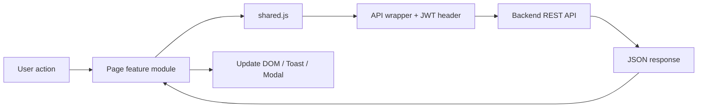

# Forge AI Frontend

## Overview

Forge AI เป็นเว็บ frontend สำหรับแพลตฟอร์มสร้างภาพด้วย AI ผู้ใช้สามารถเข้าสู่ระบบ เลือกโมเดล เขียน prompt สร้างภาพแบบ Text to Image หรือ Image to Image และดาวน์โหลดผลลัพธ์ได้

นอกจาก image engine แล้ว ระบบมี gallery, history และหน้า profile โดยโค้ดใช้ ES Modules แบบไม่ต้องผ่าน build step จึงเหมาะกับการพัฒนาและทดลองเชื่อมต่อ REST API โดยตรง

## Tech Stack

- Vanilla JavaScript ด้วย native ES Modules
- Semantic HTML5
- CSS แบบ custom พร้อม responsive dark theme
- REST API ผ่าน `fetch`
- JWT authentication ผ่าน `Authorization: Bearer <token>`
- ไม่มี framework และไม่มี build step
- `package.json` เฉพาะสำหรับกำหนด ES module mode และรัน test ด้วย Node.js

## Project Structure

```text
frontend/
├── about.html              # ข้อมูลระบบ ทีม และเทคโนโลยี
├── gallery.html            # gallery ภาพที่สร้าง พร้อม modal รายละเอียด
├── history.html            # ประวัติการสร้าง filter และ pagination
├── home.html               # AI Image Engine: Text to Image และ Image to Image
├── index.html              # landing page และทางเข้าสู่ระบบ
├── login.html              # login/register ในหน้าเดียว
├── members.html            # profile, แก้ไขข้อมูล และ logout
├── forgot-password.html    # recovery UI สำหรับรอ backend endpoint
├── login.css               # style เฉพาะหน้า login
├── style.css               # design system และ responsive styles กลาง
├── API_CONTRACT.md         # สัญญา endpoint ที่ frontend คาดหวัง
├── package.json            # กำหนด type=module สำหรับ Node test
├── nginx/
│   └── nginx.conf          # configuration สำหรับเสิร์ฟ frontend/proxy
└── js/
    ├── shared.js          # config, API wrapper, UI helpers และ navbar
    ├── auth.js            # token/session, auth guard และ login/register
    ├── generator.js       # logic ของ Text to Image และ Image to Image
    ├── gallery.js         # โหลดและ render gallery
    ├── history.js         # โหลด filter และ render history
    ├── members.js         # logic หน้า profile
    ├── validators.js      # pure validation functions ที่ใช้ซ้ำได้
    └── validators.test.js # plain Node.js tests สำหรับ validators
```

## Pages & Features

| Page | Login required | Features | JavaScript |
|---|---:|---|---|
| `index.html` | ไม่ต้อง | Landing page และ redirect ผู้ใช้ที่ login แล้ว | `auth.js`, `shared.js` |
| `login.html` | ไม่ต้อง | Sign in, register, validation, Remember Me | `auth.js`, `shared.js` |
| `forgot-password.html` | ไม่ต้อง | Recovery UI placeholder | `auth.js`, `shared.js` |
| `home.html` | ต้อง | Text to Image, Image to Image, model selection, advanced settings, upload และ download | `generator.js`, `auth.js`, `shared.js` |
| `gallery.html` | ต้อง | Gallery grid, mock/API data และรายละเอียดใน modal | `gallery.js`, `auth.js`, `shared.js` |
| `history.html` | ต้อง | Filter ตาม type/date, pagination และ prompt details | `history.js`, `auth.js`, `shared.js` |
| `members.html` | ต้อง | User profile, แก้ username/password และ logout | `members.js`, `auth.js`, `shared.js` |
| `about.html` | ไม่ต้อง | ข้อมูลระบบและทีม | `auth.js`, `shared.js` |

## Architecture / Data Flow

หน้าที่ต้อง login เรียก `injectNavbar()` จาก `shared.js` ซึ่งตรวจ token ก่อน inject sidebar ส่วน feature module จะผูก event handlers ของหน้านั้นเอง



ตัวอย่าง flow การสร้างภาพ:

```text
Submit form
  -> generator.js อ่าน prompt/model/parameters
  -> shared.js: apiFetch()
  -> POST /api/generate
  -> response.image_url
  -> generator.js อัปเดต result state และ download link
```

## Authentication

- หลัง login/register สำเร็จ frontend เก็บ `forge_token` และ `forge_user`
- ถ้าเลือก `Remember Me` จะใช้ `localStorage`
- ถ้าไม่เลือกจะใช้ `sessionStorage`
- `injectNavbar({ protect: true })` ตรวจ token ก่อนแสดงหน้าที่ protected
- ถ้าไม่มี token จะ redirect ไป `login.html`
- Logout ลบ token/user จากทั้งสอง storage แล้ว redirect กลับหน้า login
- `shared.js` แนบ token เป็น `Authorization: Bearer <token>` ใน API request
- เมื่อ backend ตอบ `401`, `apiFetch()` จะ throw error; การจัดการหมดอายุแบบ redirect อัตโนมัติควรเพิ่มใน auth policy ของ backend/frontend ในอนาคต

## Getting Started (Local Development)

1. เปิดโฟลเดอร์ `frontend/` ใน VS Code
2. เปิด `index.html` ผ่าน Live Server หรือ Five Server
3. สำหรับทดสอบหน้า protected ให้ login ผ่าน `login.html` ก่อน
4. หากต้องการรัน validation tests:

```powershell
cd frontend
node js/validators.test.js
```

ไม่จำเป็นต้อง `npm install` เพราะไม่มี dependency ภายนอกหรือ build process

## Configuration

แก้ค่า backend ได้ในส่วน Config ด้านบนของ [js/shared.js](js/shared.js):

```js
export const CONFIG = {
  USE_DEMO_MODE: true,
  API_BASE_URL: '/api'
};
```

- ตั้ง `USE_DEMO_MODE: false` เมื่อต้องการเรียก backend จริง
- เปลี่ยน `API_BASE_URL` เป็น URL หรือ reverse-proxy path ของ backend
- endpoint names อยู่ใน `CONFIG.ENDPOINTS`

## Known Limitations / TODO

- `USE_DEMO_MODE` ยังเปิดอยู่เป็นค่าเริ่มต้น
- Gallery และ History ยังมี mock data เมื่อ demo mode ทำงาน
- หน้า profile ยังแก้ข้อมูลใน browser และยังไม่ได้เรียก GET/PUT `/profile` จริง
- Forgot password ยังไม่มี backend endpoint
- Image to Image ส่งชื่อไฟล์เป็น placeholder ใน JSON; production ควรตกลง multipart upload, data URL หรือ asset id
- Generate response ปัจจุบันคาดหวังผลลัพธ์ใน request เดียว ยังไม่มี polling สำหรับงานที่ตอบ `202`
- การจัดการ JWT หมดอายุแบบ global redirect เมื่อได้ `401` ยังควรทำให้เป็นมาตรฐานเดียวกัน
